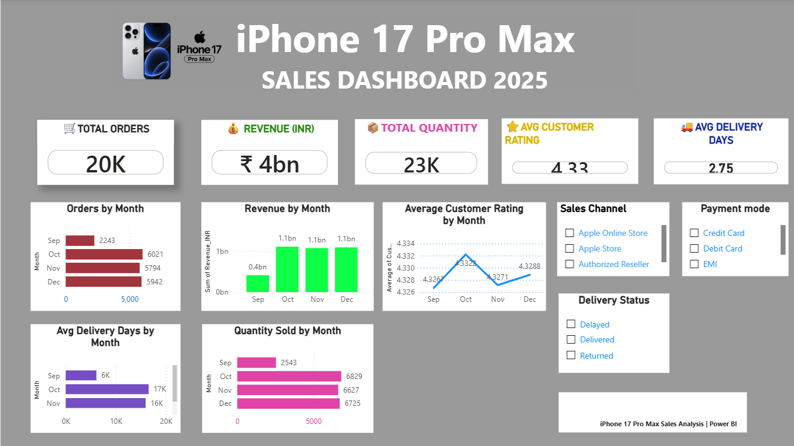

 ## Dashboard Preview

## Project Overview
An interactive Power BI dashboard analyzing iPhone 17 Pro Max sales performance for 2025.

## Key KPIs
- Total Orders: 20K
- Total Revenue: ₹4bn
- Total Quantity: 23K
- Average Customer Rating: 4.33
- Average Delivery Days: 2.75

## Analysis
- Monthly Orders
- Monthly Revenue
- Quantity Sold by Month
- Average Customer Rating
- Average Delivery Days
- Sales Channel
- Payment Mode
- Delivery Status

## Tools Used
- Power BI
- Power Query
- Microsoft Excel

## Dashboard Preview

